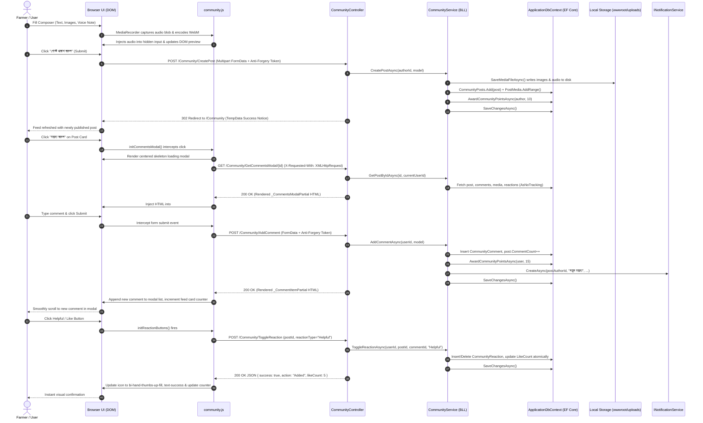

# KrishiLink Community Hub: Complete Backend Connection, API Contracts, and Frontend Wiring Specification
## Technical Architecture, Data Layer, Service Logic, Controller Endpoints, and Client-Side AJAX Wiring Manual

Document Version: 2.0.0  
Status: Authoritative Production Engineering Specification  
Target Platform: ASP.NET Core 9 MVC, Entity Framework Core, Microsoft SQL Server, Bootstrap 5.3, Vanilla JavaScript (ES6+), HTML5 Web Audio API  
Companion Document: `COMMUNITY_PAGE_UI_DESIGN.md`  
Target File: `/media/arkosaha/Volume13/KrishiLink/COMMUNITY_BACKEND_INTEGRATION_AND_WIRING.md`

---

## Table of Contents
1. [Executive Technical Overview and Architecture](#1-executive-technical-overview-and-architecture)
2. [Data Persistence Layer: Entity Models, Mappings, and Schema](#2-data-persistence-layer-entity-models-mappings-and-schema)
3. [Business Logic Layer (BLL): Services and Agronomic Algorithms](#3-business-logic-layer-bll-services-and-agronomic-algorithms)
4. [Controller Endpoints and API Contract Specification](#4-controller-endpoints-and-api-contract-specification)
5. [Frontend Client-Side Wiring (`community.js`) and AJAX Protocols](#5-frontend-client-side-wiring-communityjs-and-ajax-protocols)
6. [View Component Hierarchy and Partial Rendering Mapping](#6-view-component-hierarchy-and-partial-rendering-mapping)
7. [Gamification, Notifications, and Auxiliary Services Integration](#7-gamification-notifications-and-auxiliary-services-integration)
8. [Security, Authorization, Validation, and Exception Handling](#8-security-authorization-validation-and-exception-handling)
9. [Comprehensive Verification, QA Scenarios, and Deployment Checklist](#9-comprehensive-verification-qa-scenarios-and-deployment-checklist)

---

## 1. Executive Technical Overview and Architecture

### 1.1 Architectural Philosophy
The KrishiLink Community Hub is an integrated, low-latency agricultural social network and peer-to-peer advisory platform built on ASP.NET Core 9 MVC. It combines server-rendered Razor partials for search-engine discoverability and fast first-contentful-paint (FCP) with modern asynchronous client-side interactions (AJAX via standard `fetch`, Web Audio API recording, and dynamic centered modal injections).

The system architecture prioritizes:
1. **Zero-Page-Reload Core Interactions**: Reactions, bookmarking, voice note playback, comment modal loading, and solution acceptance execute via asynchronous AJAX requests without interrupting the user's feed position.
2. **Strict Identity and Anti-Forgery Security**: Every mutation endpoint enforces state verification via ASP.NET Core Anti-Forgery Tokens passed via custom headers (`RequestVerificationToken`) or multipart form payloads, backed by ASP.NET Identity claim extraction.
3. **Resilient Offline/Low-Bandwidth Operation**: Media files and voice notes are compressed, validated, stamped with unique GUIDs, and served with cache-friendly relative paths, ensuring responsiveness even in 3G rural network environments.
4. **Clean Decoupled Layering**: Clean separation across Data Access Layer (DAL), Business Logic Layer (BLL), Controller endpoints, Razor views, and client-side JavaScript.

### 1.2 End-to-End System Request Lifecycle Flow



---

## 2. Data Persistence Layer: Entity Models, Mappings, and Schema

### 2.1 Entity Models & Relational Architecture

The data access layer is implemented using Entity Framework Core within [`DAL/ApplicationDbContext.cs`](file:///media/arkosaha/Volume13/KrishiLink/DAL/ApplicationDbContext.cs). The database schema resides in Microsoft SQL Server (`krishilink_mssql`).

#### 1. `CommunityPost` (`Models/Entities/CommunityPost.cs`)
Represents an individual community discussion, agricultural experience, or urgent crop distress query.

| Column Name | Data Type | Nullable | Default | Description |
|:---|:---|:---|:---|:---|
| `Id` | `int` | No | Identity PK | Unique post identifier |
| `AuthorId` | `nvarchar(450)` | No | - | Foreign Key referencing `AspNetUsers.Id` |
| `Content` | `nvarchar(max)` | No | - | Full text body of the post |
| `PostType` | `nvarchar(50)` | No | `'Experience'` | Category type: `Experience`, `HelpNeeded`, `AgritechTip` |
| `CropCategory` | `nvarchar(100)` | Yes | `NULL` | Targeted crop (e.g. Aman Rice, Potato, Wheat) |
| `IssueCategory` | `nvarchar(150)` | Yes | `NULL` | Agronomic issue category (e.g. Fungal Blight, Pest Attack) |
| `UrgencyLevel` | `nvarchar(20)` | No | `'Normal'` | Crisis priority: `Normal`, `Moderate`, `High` |
| `CropAge` | `nvarchar(50)` | Yes | `NULL` | Age/growth stage of crop (e.g. ৩০ দিন) |
| `AffectedArea` | `nvarchar(100)` | Yes | `NULL` | Land area affected (e.g. ২ বিঘা) |
| `District` | `nvarchar(100)` | Yes | `NULL` | Administrative district of origin |
| `Upazila` | `nvarchar(100)` | Yes | `NULL` | Sub-district location |
| `IsHelpRequest` | `bit` | No | `0` | Boolean indicator for triage workflows |
| `IsSolved` | `bit` | No | `0` | Flag indicating problem has been solved |
| `AcceptedCommentId` | `int` | Yes | `NULL` | Foreign Key referencing winning `CommunityComment.Id` |
| `AudioRecordingUrl` | `nvarchar(500)` | Yes | `NULL` | Path to recorded voice note (`/uploads/community/audio/...`) |
| `AudioDurationSeconds` | `int` | Yes | `NULL` | Voice note duration in seconds |
| `ViewCount` | `int` | No | `0` | Total views counter |
| `LikeCount` | `int` | No | `0` | Total reaction/like counter |
| `CommentCount` | `int` | No | `0` | Total comment/solution counter |
| `ShareCount` | `int` | No | `0` | Total share counter |
| `IsPinned` | `bit` | No | `0` | Admin sticky broadcast pin |
| `IsFlagged` | `bit` | No | `0` | Content moderation review flag |
| `CreatedAt` | `datetime2` | No | `SYSUTCDATETIME()` | UTC post publication timestamp |
| `UpdatedAt` | `datetime2` | Yes | `NULL` | UTC last edit timestamp |

#### 2. `CommunityComment` (`Models/Entities/CommunityComment.cs`)
Represents an answer, peer observation, or accepted expert diagnosis on a post.

| Column Name | Data Type | Nullable | Default | Description |
|:---|:---|:---|:---|:---|
| `Id` | `int` | No | Identity PK | Unique comment identifier |
| `PostId` | `int` | No | - | Foreign Key referencing `CommunityPosts.Id` (Cascade Delete) |
| `AuthorId` | `nvarchar(450)` | No | - | Foreign Key referencing `AspNetUsers.Id` |
| `ParentCommentId` | `int` | Yes | `NULL` | Self-referencing FK for nested replies |
| `Content` | `nvarchar(max)` | No | - | Text content of comment/solution |
| `AttachmentImageUrl` | `nvarchar(500)` | Yes | `NULL` | Uploaded prescription photo / leaf image |
| `AudioRecordingUrl` | `nvarchar(500)` | Yes | `NULL` | Uploaded voice response audio |
| `AudioDurationSeconds` | `int` | Yes | `NULL` | Audio response length |
| `IsAcceptedSolution` | `bit` | No | `0` | Highlights comment as official verified solution |
| `UpvoteCount` | `int` | No | `0` | Number of helpful votes received |
| `CreatedAt` | `datetime2` | No | `SYSUTCDATETIME()` | UTC comment submission timestamp |

#### 3. `CommunityReaction` (`Models/Entities/CommunityReaction.cs`)
Polymorphic interaction tracking for posts and comments.

| Column Name | Data Type | Nullable | Default | Description |
|:---|:---|:---|:---|:---|
| `Id` | `int` | No | Identity PK | Reaction unique identifier |
| `UserId` | `nvarchar(450)` | No | - | Foreign Key referencing `AspNetUsers.Id` |
| `PostId` | `int` | Yes | `NULL` | Targeted Post ID (if post reaction) |
| `CommentId` | `int` | Yes | `NULL` | Targeted Comment ID (if comment reaction) |
| `ReactionType` | `nvarchar(50)` | No | `'Helpful'` | Type: `Helpful`, `Like`, `Agritech` |
| `CreatedAt` | `datetime2` | No | `SYSUTCDATETIME()` | UTC timestamp |

*Database Constraint*: An application-level composite check prevents duplicate reactions by a single user on the same post or comment.

#### 4. `CommunityBookmark` (`Models/Entities/CommunityBookmark.cs`)
Enables personal agronomic library curation ("সংরক্ষিত পোস্ট").

| Column Name | Data Type | Nullable | Default | Description |
|:---|:---|:---|:---|:---|
| `Id` | `int` | No | Identity PK | Bookmark identifier |
| `UserId` | `nvarchar(450)` | No | - | Foreign Key referencing `AspNetUsers.Id` |
| `PostId` | `int` | No | - | Foreign Key referencing `CommunityPosts.Id` |
| `CreatedAt` | `datetime2` | No | `SYSUTCDATETIME()` | UTC timestamp |

#### 5. `PostMedia` (`Models/Entities/PostMedia.cs`)
Normalized gallery holding up to 5 photos and 1 video per post.

| Column Name | Data Type | Nullable | Default | Description |
|:---|:---|:---|:---|:---|
| `Id` | `int` | No | Identity PK | Media record identifier |
| `PostId` | `int` | No | - | Foreign Key referencing `CommunityPosts.Id` (Cascade) |
| `MediaUrl` | `nvarchar(500)` | No | - | Relative URL (`/uploads/community/images/...`) |
| `MediaType` | `nvarchar(20)` | No | `'Image'` | Values: `Image`, `Video` |
| `ThumbnailUrl` | `nvarchar(500)` | Yes | `NULL` | Video preview thumbnail if generated |
| `SortOrder` | `int` | No | `0` | Display sequencing order (0 to 4 for images; 99 for video) |

#### 6. `CommunityPostReport` (`Models/Entities/CommunityPostReport.cs`)
Content moderation log for flagged community posts.

| Column Name | Data Type | Nullable | Default | Description |
|:---|:---|:---|:---|:---|
| `Id` | `int` | No | Identity PK | Report identifier |
| `PostId` | `int` | No | - | Foreign Key referencing `CommunityPosts.Id` |
| `ReporterId` | `nvarchar(450)` | No | - | Foreign Key referencing `AspNetUsers.Id` |
| `Reason` | `nvarchar(500)` | No | - | Specific violation reasoning |
| `Status` | `nvarchar(50)` | No | `'Pending'` | Status: `Pending`, `Reviewed`, `Dismissed` |
| `CreatedAt` | `datetime2` | No | `SYSUTCDATETIME()` | UTC timestamp |

### 2.2 EF Core Fluent API Configurations in `ApplicationDbContext`

The relationships, index strategies, and cascade behaviors are configured in [`DAL/ApplicationDbContext.cs`](file:///media/arkosaha/Volume13/KrishiLink/DAL/ApplicationDbContext.cs):

```csharp
// CommunityPost Relationships
builder.Entity<CommunityPost>(entity =>
{
    entity.HasKey(p => p.Id);
    entity.Property(p => p.Content).IsRequired();
    entity.Property(p => p.PostType).HasMaxLength(50).IsRequired();
    entity.Property(p => p.UrgencyLevel).HasMaxLength(20).IsRequired();

    entity.HasOne(p => p.Author)
          .WithMany()
          .HasForeignKey(p => p.AuthorId)
          .OnDelete(DeleteBehavior.Restrict);

    entity.HasOne(p => p.AcceptedComment)
          .WithMany()
          .HasForeignKey(p => p.AcceptedCommentId)
          .OnDelete(DeleteBehavior.NoAction);

    // Performance Indexes
    entity.HasIndex(p => p.CreatedAt).HasDatabaseName("IX_CommunityPosts_CreatedAt");
    entity.HasIndex(p => new { p.IsHelpRequest, p.IsSolved }).HasDatabaseName("IX_CommunityPosts_HelpTriage");
    entity.HasIndex(p => p.District).HasDatabaseName("IX_CommunityPosts_District");
    entity.HasIndex(p => p.AuthorId).HasDatabaseName("IX_CommunityPosts_AuthorId");
});

// CommunityComment Configuration
builder.Entity<CommunityComment>(entity =>
{
    entity.HasKey(c => c.Id);
    entity.Property(c => c.Content).IsRequired();

    entity.HasOne(c => c.Author)
          .WithMany()
          .HasForeignKey(c => c.AuthorId)
          .OnDelete(DeleteBehavior.Restrict);

    entity.HasOne<CommunityPost>()
          .WithMany(p => p.Comments)
          .HasForeignKey(c => c.PostId)
          .OnDelete(DeleteBehavior.Cascade);

    entity.HasOne<CommunityComment>()
          .WithMany(c => c.Replies)
          .HasForeignKey(c => c.ParentCommentId)
          .OnDelete(DeleteBehavior.NoAction);
});

// Reaction Indexes
builder.Entity<CommunityReaction>(entity =>
{
    entity.HasIndex(r => new { r.UserId, r.PostId, r.CommentId })
          .HasDatabaseName("IX_CommunityReactions_UserTarget");
});
```

---

## 3. Business Logic Layer (BLL): Services and Agronomic Algorithms

### 3.1 Service Contracts (`ICommunityService.cs`)

The contract defined in [`BLL/Services/ICommunityService.cs`](file:///media/arkosaha/Volume13/KrishiLink/BLL/Services/ICommunityService.cs) exposes 12 domain operations:

```csharp
public interface ICommunityService
{
    Task<CommunityFeedViewModel> GetFeedAsync(
        string? currentUserId,
        string? category = "All",
        string? district = null,
        string? urgency = null,
        string? sort = "Latest",
        string? searchQuery = null,
        int pageNumber = 1,
        int pageSize = 15);

    Task<CommunityPostViewModel?> GetPostByIdAsync(int postId, string? currentUserId);
    Task<int> CreatePostAsync(string authorId, CommunityPostCreateViewModel model);
    Task<CommunityCommentViewModel?> AddCommentAsync(string authorId, CommunityCommentCreateViewModel model);
    Task<(bool Success, string Action, int LikeCount, string ReactionType)> ToggleReactionAsync(
        string userId, int? postId, int? commentId, string reactionType);
    Task<(bool Success, string Message)> AcceptSolutionAsync(string currentUserId, int postId, int commentId);
    Task<(bool Success, bool IsBookmarked)> ToggleBookmarkAsync(string userId, int postId);
    Task<bool> ReportPostAsync(string reporterId, int postId, string reason);
    Task<bool> DeletePostAsync(string userId, bool isAdmin, int postId);
    Task<List<EmergencyAlertItemViewModel>> GetEmergencyAlertsAsync(string? district, int limit = 3);
    Task<List<TopMentorViewModel>> GetTopMentorsAsync(int limit = 3);
    Task<CommunityWeatherAdvisorViewModel> GetWeatherAdvisorAsync(string? district);
}
```

### 3.2 Feed Aggregation and Multi-Criteria Filtering Mechanics

The feed retrieval pipeline in [`BLL/Services/CommunityService.cs`](file:///media/arkosaha/Volume13/KrishiLink/BLL/Services/CommunityService.cs) coordinates database querying, multi-criteria filtering, search matching, and smart sorting:

```csharp
var query = _db.CommunityPosts
    .Include(p => p.Author)
    .Include(p => p.MediaList)
    .Include(p => p.AcceptedComment)
        .ThenInclude(c => c!.Author)
    .AsNoTracking()
    .AsQueryable();
```

#### Category Filters
- `All`: Returns all posts.
- `HelpNeeded` / `Urgent`: `p => p.IsHelpRequest && !p.IsSolved`.
- `Experience`: `p => p.PostType == CommunityPostTypes.Experience`.
- `AgritechTip` / `Tips`: `p => p.PostType == CommunityPostTypes.AgritechTip`.
- `Solved`: `p => p.IsSolved`.
- `MyPosts`: `p => p.AuthorId == currentUserId`.
- `Saved`: Post IDs mapped from `CommunityBookmarks` matching `currentUserId`.

#### District & Urgency Filtering
- District scoping: `p.District == district || p.Author.District == district`.
- Urgency scoping: `p.UrgencyLevel == urgency`.

#### Full-Text Search Scope
Search matches against four fields simultaneously:
```csharp
query = query.Where(p => p.Content.Contains(term)
    || (p.CropCategory != null && p.CropCategory.Contains(term))
    || (p.IssueCategory != null && p.IssueCategory.Contains(term))
    || p.Author.FullName.Contains(term));
```

#### Multi-Factor Ranking Algorithms
Every sort criteria enforces sticky pinned posts at the top (`IsPinned DESC`):

1. **Latest**:
   $$\text{Order} = \text{IsPinned DESC} \to \text{CreatedAt DESC}$$
2. **Popular** (Weighted Community Engagement Score):
   $$\text{Score} = \text{LikeCount} + (\text{CommentCount} \times 2) + (\text{ShareCount} \times 3)$$
   $$\text{Order} = \text{IsPinned DESC} \to \text{Score DESC} \to \text{CreatedAt DESC}$$
3. **Urgent**:
   $$\text{Order} = \text{IsPinned DESC} \to (\text{IsHelpRequest} \land \neg\text{IsSolved} \land \text{UrgencyLevel}=\text{"High"}) \text{ DESC} \to \text{CreatedAt DESC}$$
4. **Proximity**:
   $$\text{Order} = \text{IsPinned DESC} \to (\text{District} = \text{User.District}) \text{ DESC} \to \text{CreatedAt DESC}$$

### 3.3 Media Ingestion and Physical File Pipeline

Media persistence is handled by `SaveMediaFileAsync(IFormFile file, string subFolder)`:

1. **Path Normalization**: Base destination is resolved using `_env.WebRootPath` (`wwwroot/uploads/{subFolder}`).
2. **Directory Verification**: `Directory.CreateDirectory(targetDir)` ensures existence.
3. **Collision Resistance**: Creates unique storage keys using:
   ```csharp
   var uniqueFileName = $"{Guid.NewGuid()}_{Path.GetFileName(file.FileName)}";
   ```
4. **Asynchronous Stream Copying**:
   ```csharp
   await using var fileStream = new FileStream(filePath, FileMode.Create);
   await file.CopyToAsync(fileStream);
   ```
5. **Database Storage**: Returns relative web path: `/uploads/{subFolder}/{uniqueFileName}`.

#### Physical Cleanup Protocol (`DeletePostAsync`)
When a post is deleted by its author or an administrator, associated physical files are removed from the filesystem:
```csharp
foreach (var m in post.MediaList)
{
    DeleteLocalFile(m.MediaUrl);
}
if (!string.IsNullOrEmpty(post.AudioRecordingUrl))
{
    DeleteLocalFile(post.AudioRecordingUrl);
}
```

### 3.4 Solution Acceptance and Gamification Protocol

When a farmer marks a comment as the verified solution via `AcceptSolutionAsync`:
1. **Ownership & Role Verification**: Verifies `currentUserId == post.AuthorId` or `User.IsInRole(AppRoles.Admin)`. Unauthorized attempts return `(false, "অননুমোদিত")`.
2. **Resetting Prior Solutions**: Any previously accepted comments for that post have `IsAcceptedSolution` set to `false`.
3. **State Mutation**:
   - `comment.IsAcceptedSolution = true;`
   - `post.IsSolved = true;`
   - `post.AcceptedCommentId = commentId;`
4. **Loyalty Points Awarded**: The resolving commenter receives +50 loyalty points via `AwardCommunityPointsAsync(comment.Author, 50, "Accepted Solution Reward")`.
5. **In-App Notification**: Triggers an alert to the solver:
   ```csharp
   await _notifications.CreateAsync(
       comment.AuthorId,
       "অভিনন্দন! আপনার সমাধান গৃহীত হয়েছে",
       "আপনার প্রদানকৃত সমাধানটি লেখক কর্তৃক সঠিক সমাধান হিসেবে গৃহীত হয়েছে এবং আপনি +৫০ কৃষি পয়েন্ট অর্জন করেছেন।",
       $"/Community/Post/{postId}"
   );
   ```

### 3.5 Real-Time Agricultural Spray Advisory Heuristics

`GetWeatherAdvisorAsync(district)` interfaces with `IWeatherService` to compute real-time agronomic spraying recommendations:

| Weather Condition | Temperature Range | Humidity Range | Spray Suitability | Bengali Recommendation Text |
|:---|:---|:---|:---|:---|
| Clear / Sunny | $20^\circ\text{C} - 32^\circ\text{C}$ | $45\% - 75\%$ | **Favorable (`true`)** | "আজ বালাইনাশক স্প্রে করার জন্য আবহাওয়া অনুকূল। সকাল ৯টা থেকে ১১টা অথবা বিকেলে স্প্রে করুন।" |
| High Temperature | $> 35^\circ\text{C}$ | Any | **Unfavorable (`false`)** | "অতিরিক্ত তাপদাহে বালাইনাশক বাষ্পীভূত হয়ে কার্যকারিতা হারাতে পারে। এখন স্প্রে করা থেকে বিরত থাকুন।" |
| High Humidity / Rain | Any | $> 85\%$ | **Unfavorable (`false`)** | "বৃষ্টি বা উচ্চ আর্দ্রতার কারণে বালাইনাশক ধুয়ে যেতে পারে। আকাশ পরিষ্কার হওয়া পর্যন্ত অপেক্ষা করুন।" |

---

## 4. Controller Endpoints and API Contract Specification

All community HTTP traffic is routed through [`Controllers/CommunityController.cs`](file:///media/arkosaha/Volume13/KrishiLink/Controllers/CommunityController.cs).

### Endpoint Summary Matrix

| HTTP Verb | Route | Auth Required | CSRF Guard | Expected Input | Output Type |
|:---|:---|:---:|:---:|:---|:---|
| `GET` | `/Community` | No | No | Query parameters (`category`, `district`, `urgency`, `sort`, `q`, `page`) | HTML (`View`) |
| `GET` | `/Community/Post/{id}` | No | No | Route parameter (`id`) | HTML (`View`) |
| `POST` | `/Community/CreatePost` | **Yes** | **Yes** | Multipart `FromForm` (`CommunityPostCreateViewModel`) | `302 Redirect` |
| `POST` | `/Community/AddComment` | **Yes** | **Yes** | Multipart `FromForm` (`CommunityCommentCreateViewModel`) | HTML (`PartialView`) or `302 Redirect` |
| `GET` | `/Community/GetCommentsModal/{id}` | No | No | Route parameter (`id`) | HTML (`PartialView`) |
| `POST` | `/Community/ToggleReaction` | **Yes** | **Yes** | `[FromForm]` (`postId`, `commentId`, `reactionType`) | `JSON` |
| `POST` | `/Community/AcceptSolution` | **Yes** | **Yes** | `[FromForm]` (`postId`, `commentId`) | `JSON` |
| `POST` | `/Community/ToggleBookmark` | **Yes** | **Yes** | `[FromForm]` (`postId`) | `JSON` |
| `POST` | `/Community/ReportPost` | **Yes** | **Yes** | `[FromForm]` (`postId`, `reason`) | `JSON` |
| `POST` | `/Community/DeletePost` | **Yes** | **Yes** | Route parameter (`id`) | `302 Redirect` |
| `GET` | `/Community/GetFeedPartial` | No | No | Query parameters (`category`, `district`, `sort`, etc.) | HTML (`PartialView`) |

---

### 4.1 Detailed Endpoint Specifications

#### 1. Feed Master Page: `GET /Community`
- **Action**: Renders the complete three-column desktop and responsive mobile feed layout.
- **Route**: `GET /Community?category={cat}&district={dist}&urgency={urg}&sort={sort}&q={query}&page={page}`
- **Security**: Publicly accessible.
- **Parameters**:
  - `category` (optional, default `"All"`): Filter by category key.
  - `district` (optional): Filter by geographical district.
  - `urgency` (optional): Filter by urgency level (`High`, `Moderate`, `Normal`).
  - `sort` (optional, default `"Latest"`): `Latest`, `Popular`, `Urgent`, `Proximity`.
  - `q` (optional): Free-text search string.
  - `page` (optional, default `1`): Pagination page index.
- **Response**: `200 OK` -> `Views/Community/Index.cshtml` bound to `CommunityFeedViewModel`.

#### 2. Single Post View: `GET /Community/Post/{id}`
- **Action**: Direct permalink viewing of a community post, complete with full discussion thread. Automatically increments `ViewCount`.
- **Route**: `GET /Community/Post/5`
- **Security**: Publicly accessible.
- **Response**:
  - `200 OK` -> `Views/Community/Post.cshtml` bound to `CommunityPostViewModel`.
  - `302 Redirect` -> If `id` does not exist, redirects to `Index` with `TempData["ErrorMessage"] = "পোস্টটি পাওয়া যায়নি..."`.

#### 3. Post Creation: `POST /Community/CreatePost`
- **Action**: Ingests new post submissions with optional photos, video, and audio voice note.
- **Route**: `POST /Community/CreatePost`
- **Security**: `[Authorize]`, `[ValidateAntiForgeryToken]`.
- **Payload (`multipart/form-data`)**:
  - `Content`: string (required, 5-3000 chars)
  - `PostType`: string (`Experience`, `HelpNeeded`, `AgritechTip`)
  - `CropCategory`: string (optional, required if `HelpNeeded`)
  - `IssueCategory`: string (optional, required if `HelpNeeded`)
  - `UrgencyLevel`: string (`Normal`, `Moderate`, `High`)
  - `CropAge`: string (optional)
  - `AffectedArea`: string (optional)
  - `District`: string (optional, defaults to author's registered district)
  - `Upazila`: string (optional)
  - `ImageFiles`: file array (up to 5 images)
  - `VideoFile`: file (max 1 video)
  - `AudioRecordingFile`: file (WebM / WAV voice note)
  - `AudioDurationSeconds`: integer (seconds)
  - `__RequestVerificationToken`: string (CSRF token)
- **Response**:
  - Valid: `302 Redirect` to `/Community` with `TempData["SuccessMessage"] = "আপনার পোস্টটি সফলভাবে কমিউনিটিতে প্রকাশ করা হয়েছে।"`.
  - Invalid: `302 Redirect` to `/Community` with `TempData["ErrorMessage"]`.

#### 4. Add Comment / Solution: `POST /Community/AddComment`
- **Action**: Adds a text, image, or voice comment to an existing post. Handles both standard form submissions and AJAX requests.
- **Route**: `POST /Community/AddComment`
- **Security**: `[Authorize]`, `[ValidateAntiForgeryToken]`.
- **Payload (`multipart/form-data`)**:
  - `PostId`: integer (required)
  - `ParentCommentId`: integer (optional, for nested replies)
  - `Content`: string (required, 2-1500 chars)
  - `ImageFile`: file (optional)
  - `AudioFile`: file (optional)
  - `AudioDurationSeconds`: integer (optional)
  - `__RequestVerificationToken`: string
- **Headers**: `X-Requested-With: XMLHttpRequest` (for AJAX).
- **Responses**:
  - **AJAX Success**: `200 OK` returning rendered Razor partial `_CommentItemPartial.cshtml` populated with `CommunityCommentViewModel`.
  - **AJAX Invalid / Unauthorized**: `400 Bad Request` `{ success: false, message: "মন্তব্য সঠিকভাবে লিখুন।" }` or `401 Unauthorized`.
  - **Standard Form Success**: `302 Redirect` to `/Community/Post/{PostId}` with `TempData["SuccessMessage"]`.

#### 5. Get Comments Modal: `GET /Community/GetCommentsModal/{id}`
- **Action**: Returns the full centered comments modal HTML for a given post.
- **Route**: `GET /Community/GetCommentsModal/5`
- **Security**: Publicly accessible.
- **Headers**: `X-Requested-With: XMLHttpRequest`.
- **Responses**:
  - `200 OK`: Returns rendered Razor partial `_CommentsModalPartial.cshtml` populated with `CommunityPostViewModel`.
  - `404 Not Found`: If `id` does not exist.

#### 6. Toggle Reaction: `POST /Community/ToggleReaction`
- **Action**: Toggles Helpful/Like state on a post or comment.
- **Route**: `POST /Community/ToggleReaction`
- **Security**: `[Authorize]`, `[ValidateAntiForgeryToken]`.
- **Payload (`multipart/form-data`)**:
  - `postId`: integer (optional)
  - `commentId`: integer (optional)
  - `reactionType`: string (`"Helpful"`)
- **Headers**:
  - `RequestVerificationToken`: token string
  - `X-Requested-With: XMLHttpRequest`
- **Response**: `200 OK` (JSON):
  ```json
  {
    "success": true,
    "action": "Added",
    "likeCount": 14,
    "reactionType": "Helpful"
  }
  ```
  *(If removed: `"action": "Removed"`, `"likeCount": 13`)*

#### 7. Accept Solution: `POST /Community/AcceptSolution`
- **Action**: Marks a comment as the verified solution, closes the help request, and awards +50 points.
- **Route**: `POST /Community/AcceptSolution`
- **Security**: `[Authorize]`, `[ValidateAntiForgeryToken]`.
- **Payload (`multipart/form-data`)**:
  - `postId`: integer (required)
  - `commentId`: integer (required)
- **Headers**:
  - `RequestVerificationToken`: token string
  - `X-Requested-With: XMLHttpRequest`
- **Response**: `200 OK` (JSON):
  ```json
  {
    "success": true,
    "message": "সঠিক সমাধান হিসেবে সফলভাবে গৃহীত হয়েছে।"
  }
  ```

#### 8. Toggle Bookmark: `POST /Community/ToggleBookmark`
- **Action**: Saves or unsaves a post in the user's personal agronomic library.
- **Route**: `POST /Community/ToggleBookmark`
- **Security**: `[Authorize]`, `[ValidateAntiForgeryToken]`.
- **Payload (`multipart/form-data`)**:
  - `postId`: integer (required)
- **Response**: `200 OK` (JSON):
  ```json
  {
    "success": true,
    "isBookmarked": true
  }
  ```

#### 9. Report Content: `POST /Community/ReportPost`
- **Action**: Submits a moderation violation report.
- **Route**: `POST /Community/ReportPost`
- **Security**: `[Authorize]`, `[ValidateAntiForgeryToken]`.
- **Payload (`multipart/form-data`)**:
  - `postId`: integer (required)
  - `reason`: string (required)
- **Response**: `200 OK` (JSON):
  ```json
  {
    "success": true,
    "message": "রিপোর্টটি সফলভাবে জমা নেওয়া হয়েছে।"
  }
  ```

#### 10. Delete Post: `POST /Community/DeletePost`
- **Action**: Deletes a post, cascades comments and reactions, and cleans up local media files.
- **Route**: `POST /Community/DeletePost?id=5`
- **Security**: `[Authorize]`, `[ValidateAntiForgeryToken]`. Author or Admin only.
- **Response**: `302 Redirect` to `/Community` with `TempData["SuccessMessage"] = "পোস্টটি মুছে ফেলা হয়েছে।"`.

#### 11. Feed Asynchronous Partial Stream: `GET /Community/GetFeedPartial`
- **Action**: Returns only the post list partial view for dynamic tab switching without page reload.
- **Route**: `GET /Community/GetFeedPartial?category={cat}&district={dist}&sort={sort}`
- **Security**: Publicly accessible.
- **Response**: `200 OK` -> `Views/Community/_PostListPartial.cshtml` bound to `CommunityFeedViewModel`.

---

## 5. Frontend Client-Side Wiring (`community.js`) and AJAX Protocols

The frontend client-side orchestration is contained in [`wwwroot/js/community.js`](file:///media/arkosaha/Volume13/KrishiLink/wwwroot/js/community.js). The script initializes on `DOMContentLoaded` and coordinates 10 interactive modules.

```javascript
document.addEventListener("DOMContentLoaded", function () {
    initComposerTypeToggle();
    initComposerMediaPreview();
    initVoiceRecorder();
    initAudioPlayers();
    initReactionButtons();
    initCommentForms();
    initAcceptSolutionButtons();
    initBookmarkButtons();
    initCopyLinkButtons();
    initCommentsModal();
});
```

### 5.1 Anti-Forgery Token Extraction Protocol

All asynchronous `POST` requests in `community.js` dynamically extract the Anti-Forgery Token injected by ASP.NET Core:

```javascript
const tokenInput = document.querySelector("input[name='__RequestVerificationToken']");
const token = tokenInput ? tokenInput.value : "";
```

The token is transmitted in both locations for maximum compatibility:
1. Custom Request Header: `"RequestVerificationToken": token`
2. Form Payload: Injected into the `FormData` instance.

---

### 5.2 Module-by-Module Technical Breakdown

#### Module 1: Composer Type Switcher (`initComposerTypeToggle`)
- **DOM Targets**: `input[name='PostType']`, `#helpNeededFieldsContainer`, `#createPostModal`.
- **Logic**:
  - When the user selects the `"HelpNeeded"` radio button, `#helpNeededFieldsContainer` is displayed (`display: block`).
  - Form elements inside `#helpNeededFieldsContainer` (`CropCategory`, `IssueCategory`) have their HTML5 `required` attribute dynamically set to `true`.
  - When switching back to `"Experience"` or `"AgritechTip"`, the container is hidden (`display: none`) and `required` is removed.
  - Shortcut triggers on the feed composer card (`data-post-tab="HelpNeeded"`) auto-select the corresponding radio and open `#createPostModal` with the appropriate fields pre-expanded.

#### Module 2: Client-Side Media Preview Tray (`initComposerMediaPreview`)
- **DOM Targets**: `#composerImageFileInput`, `#composerMediaPreviewTray`.
- **Logic**:
  - Listens for the `change` event on the file input.
  - Slices `this.files` to enforce a maximum of 5 images.
  - Uses the HTML5 `FileReader` API:
    ```javascript
    const reader = new FileReader();
    reader.onload = function (e) {
        const thumb = document.createElement("div");
        thumb.className = "preview-thumb-container";
        thumb.innerHTML = `
            
            <button type="button" class="remove-thumb-btn"><i class="bi bi-x"></i></button>
        `;
        tray.appendChild(thumb);
    };
    reader.readAsDataURL(file);
    ```
  - Allows individual preview removal via `.remove-thumb-btn`.

#### Module 3: Web Audio Voice Note Recorder (`initVoiceRecorder`)
- **DOM Targets**: `#startVoiceRecordingBtn`, `#composerVoicePreview`, `#voiceRecordedTimer`, `#deleteVoiceRecordingBtn`.
- **Logic**:
  - Requests microphone stream via `navigator.mediaDevices.getUserMedia({ audio: true })`.
  - Initializes `MediaRecorder(stream)` and accumulates audio chunks into an array on `ondataavailable`.
  - Starts a live elapsed timer (`voiceTimerInterval`) updated every 1000ms. Enforces a 60-second hardware recording cap.
  - On `stop`:
    1. Creates a WebM blob: `new Blob(audioChunks, { type: "audio/webm" })`.
    2. Converts blob to a file: `new File([audioBlob], "voice_note_....webm", { type: "audio/webm" })`.
    3. Injects the file into a hidden input (`#hiddenAudioFileInput`) using the `DataTransfer` API:
       ```javascript
       const dataTransfer = new DataTransfer();
       dataTransfer.items.add(audioFile);
       audioInput.files = dataTransfer.files;
       ```
    4. Displays the preview badge with formatted duration (`MM:SS`).
    5. Releases hardware audio tracks: `stream.getTracks().forEach(t => t.stop())`.

#### Module 4: Custom Audio Players (`initAudioPlayers`)
- **DOM Targets**: `.audio-play-btn`, `.community-audio-player`, `.audio-progress`, `.audio-time`.
- **Logic**:
  - Reads `data-audio-src` attribute from the button.
  - **Single-Stream Mutex**: If another audio clip is currently playing, it is stopped and its play button icon is reset before starting the new track.
  - Tracks playback state using the HTML5 `Audio` API.
  - Listens for `timeupdate` events to advance the progress bar:
    ```javascript
    const pct = (audio.currentTime / audio.duration) * 100;
    progressBar.style.width = pct + "%";
    ```
  - Formats current time and total duration as `MM:SS / MM:SS`.
  - On audio `ended`: Resets the icon to `bi-play-fill` and resets progress bar width to `0%`.

#### Module 5: AJAX Reaction / Like Button (`initReactionButtons`)
- **DOM Targets**: `.post-reaction-btn`, `.comment-like-btn`.
- **Idempotency Guard**: Sets `btn.dataset.reactionBound = "true"` to prevent duplicate event listeners on dynamically injected partials.
- **Logic**:
  - Reads `data-post-id` or `data-comment-id`.
  - Sends asynchronous `POST` to `/Community/ToggleReaction` with anti-forgery headers.
  - On `200 OK`:
    - Updates like count text in `.post-like-count-display .count-val`.
    - Toggles icon classes between `bi-hand-thumbs-up` and `bi-hand-thumbs-up-fill`.
    - Toggles color classes between `text-muted` and `text-success fw-bold`.
  - On `401 Unauthorized`: Redirects user to `/Account/Login`.

#### Module 6: Centered Comments Modal (`initCommentsModal`)
- **DOM Targets**: `#communityCommentsModal`, `.open-comments-modal-btn`.
- **Logic**:
  1. User clicks `"মন্তব্য করুন"` on any post card in the feed.
  2. The script shows a centered Bootstrap 5 modal containing an animated spinner.
  3. Sends `GET /Community/GetCommentsModal/{postId}` via AJAX.
  4. Injects the returned `_CommentsModalPartial.cshtml` HTML into `#communityCommentsModal`.
  5. Binds the modal's comment submission form (`bindModalForm(postId)`):
     - Prevents default form submit.
     - Sends `POST /Community/AddComment` with `FormData`.
     - Injects the returned `_CommentItemPartial.cshtml` into `#modal-comments-list-{postId}`.
     - Increments the modal header badge count (`#modal-comment-badge-count`).
     - Simultaneously finds the feed post card (`#post-card-{postId}`) and increments its `.comment-count-val`.
     - Smoothly scrolls the modal body to the bottom to display the newly submitted comment.
     - Re-initializes event listeners (`initReactionButtons`, `initAcceptSolutionButtons`, `initAudioPlayers`) on the newly injected elements.

#### Module 7: In-Page Quick Comment Forms (`initCommentForms`)
- **DOM Targets**: `.community-comment-form`.
- **Logic**: Provides identical AJAX submission capabilities for single post view pages (`/Community/Post/{id}`) or embedded inline forms, injecting `_CommentItemPartial.cshtml` directly into `#comments-list-{postId}`.

#### Module 8: Solution Acceptance Workflow (`initAcceptSolutionButtons`)
- **DOM Targets**: `.accept-solution-btn`.
- **Logic**:
  - Displays confirmation dialog: `"আপনি কি নিশ্চিত যে এই মন্তব্যটি আপনার ফসলের সমস্যার সঠিক সমাধান করেছে?"`.
  - Sends `POST /Community/AcceptSolution` with `postId` and `commentId`.
  - On `200 OK`: Displays alert confirmation that 50 loyalty points were awarded to the solver, then reloads the window to display the verified solution card and green "সমাধান হয়েছে" status pills.

#### Module 9: Bookmark Toggle (`initBookmarkButtons`)
- **DOM Targets**: `.bookmark-toggle-btn`.
- **Logic**:
  - Sends `POST /Community/ToggleBookmark`.
  - On `200 OK`:
    - If `isBookmarked == true`: Changes icon to `bi-bookmark-fill`, adds `text-success fw-bold`, and updates label to `"সংরক্ষিত থেকে সরান"`.
    - If `isBookmarked == false`: Changes icon to `bi-bookmark`, removes `text-success`, and updates label to `"পোস্ট সংরক্ষণ করুন"`.

#### Module 10: Copy Permalink (`initCopyLinkButtons`)
- **DOM Targets**: `.copy-link-btn`.
- **Logic**:
  - Reads `data-link` (e.g. `/Community/Post/5`).
  - Synthesizes full URL: `window.location.origin + relativeLink`.
  - Writes to clipboard via `navigator.clipboard.writeText(fullUrl)`.
  - Displays user feedback alert: `"পোস্টের লিংক ক্লিপবোর্ডে কপি করা হয়েছে!"`.

---

## 6. View Component Hierarchy and Partial Rendering Mapping

### 6.1 View Component Architecture

```
Views/Community/
│
├── Index.cshtml                   # Master Feed Page View
│   ├── Left Sidebar               # Identity Card, Category Navigation, District Selector
│   ├── Central Feed Column
│   │   ├── _PostComposerCard      # Interactive Post Composer (In-Page)
│   │   ├── Filter/Sorting Bar     # Category Pills, Urgency & Sort Dropdowns
│   │   └── _PostListPartial.cshtml
│   │       └── _PostCardPartial.cshtml (Repeated per post)
│   │           └── _CommentItemPartial.cshtml (When comments expanded)
│   ├── Right Sidebar              # Emergency Alert, Weather Advisor, Top Mentors
│   ├── Create Post Modal          # Full composer modal with audio/photo uploads
│   └── Centered Comments Modal    # #communityCommentsModal container
│
├── Post.cshtml                    # Dedicated Single Post Permalink View
│   └── Includes full post details, media gallery, accepted solution, and comment stream
│
├── _PostListPartial.cshtml        # Post collection wrapper (supports AJAX feed refresh)
├── _PostCardPartial.cshtml        # Reusable individual post card component
├── _CommentsModalPartial.cshtml   # Injected dynamically into #communityCommentsModal
└── _CommentItemPartial.cshtml     # Individual comment item component
```

### 6.2 Data Passing Contracts

| View / Partial | Model Binding | Key ViewData / TempData Keys |
|:---|:---|:---|
| `Index.cshtml` | `CommunityFeedViewModel` | `ViewData["Title"] = "কৃষি কমিউনিটি"`<br/>`TempData["SuccessMessage"]`, `TempData["ErrorMessage"]` |
| `Post.cshtml` | `CommunityPostViewModel` | `ViewData["Title"] = Model.Content.Substring(0, 30)...` |
| `_PostListPartial.cshtml` | `CommunityFeedViewModel` | Inherits parent context |
| `_PostCardPartial.cshtml` | `CommunityPostViewModel` | `ViewBag.CurrentUserId` (passed for authorization checks) |
| `_CommentsModalPartial.cshtml` | `CommunityPostViewModel` | Injected into modal; contains post metadata + comment collection |
| `_CommentItemPartial.cshtml` | `CommunityCommentViewModel` | Injected into comment lists; contains author verification flags |

---

## 7. Gamification, Notifications, and Auxiliary Services Integration

### 7.1 Loyalty Points System (`AwardCommunityPointsAsync`)

To encourage knowledge sharing and peer problem resolution, community actions award loyalty points transactionally:

| Action | Points Awarded | Audit Log Label | Triggering Method |
|:---|:---:|:---|:---|
| Publish New Post | **+10** | `"Community Post Published"` | `CreatePostAsync` |
| Submit Comment / Solution | **+15** | `"Community Comment Submitted"` | `AddCommentAsync` |
| Author Accepts Your Solution | **+50** | `"Accepted Solution Reward for Community Help"` | `AcceptSolutionAsync` |

Points update the user's `LoyaltyPoints` balance in `AspNetUsers` and are reflected in the global Leaderboard and Top Mentors widgets.

### 7.2 Notification System (`INotificationService`)

The Community Hub triggers in-app notifications via `INotificationService`:

1. **Comment Notification**:
   - **Trigger**: When User B comments on User A's post.
   - **Recipient**: Post Author (`post.AuthorId`).
   - **Title**: `"কমিউনিটি পোস্টে নতুন মন্তব্য"`
   - **Body**: `"{User B} আপনার পোস্টে একটি মন্তব্য বা সমাধান প্রদান করেছেন।"`
   - **Action URL**: `/Community/Post/{post.Id}`
2. **Solution Accepted Notification**:
   - **Trigger**: When the post author accepts User B's comment as the solution.
   - **Recipient**: Comment Author (`comment.AuthorId`).
   - **Title**: `"অভিনন্দন! আপনার সমাধান গৃহীত হয়েছে"`
   - **Body**: `"আপনার প্রদানকৃত সমাধানটি লেখক কর্তৃক সঠিক সমাধান হিসেবে গৃহীত হয়েছে এবং আপনি +৫০ কৃষি পয়েন্ট অর্জন করেছেন।"`
   - **Action URL**: `/Community/Post/{post.Id}`

---

## 8. Security, Authorization, Validation, and Exception Handling

### 8.1 Security Architecture

1. **Authentication Gates**:
   - Read operations (`Index`, `Post`, `GetCommentsModal`, `GetFeedPartial`) allow anonymous access so agricultural advice is publicly accessible.
   - Mutation operations (`CreatePost`, `AddComment`, `ToggleReaction`, `AcceptSolution`, `ToggleBookmark`, `ReportPost`, `DeletePost`) enforce authentication via `[Authorize]`. Unauthenticated requests redirect to `/Account/Login`.
2. **Cross-Site Request Forgery (CSRF / XSRF)**:
   - All mutation endpoints carry the `[ValidateAntiForgeryToken]` attribute.
   - Standard forms include `@Html.AntiForgeryToken()`.
   - AJAX requests pass the verification token via the `RequestVerificationToken` header.
3. **Role-Based Authorization & Ownership Verification**:
   - Deleting a post requires `currentUserId == post.AuthorId` or `User.IsInRole(AppRoles.Admin)`.
   - Accepting a solution requires `currentUserId == post.AuthorId` or `User.IsInRole(AppRoles.Admin)`.
4. **Input Sanitization and XSS Prevention**:
   - All model strings run `.Trim()`.
   - Output text is HTML-encoded by default via Razor (`@Model.Content`), neutralizing `<script>` and `<iframe>` injection attempts.
5. **File Upload Security**:
   - Content types validated (`image/*`, `video/*`, `audio/*`).
   - Extensions checked against allowed whitelists:
     - Images: `.jpg`, `.jpeg`, `.png`, `.webp`
     - Video: `.mp4`, `.webm`
     - Audio: `.webm`, `.wav`, `.mp3`, `.m4a`
   - Files are stored with cryptographically random GUID prefixes, preventing path traversal attacks.

---

## 9. Comprehensive Verification, QA Scenarios, and Deployment Checklist

### 9.1 End-to-End QA Test Scenarios

#### Test Scenario 1: Agricultural Distress Post Creation with Voice Note
1. Navigate to `http://localhost:5141/Community`.
2. Click `"জরুরি সমস্যা"` button on the composer card.
3. Verify `#helpNeededFieldsContainer` expands and displays crop/issue dropdowns.
4. Select `আমন ধান (Aman Rice)` and `রোগবালাই ও ছত্রাক (Fungal/Blight Disease)`.
5. Click `"ভয়েস রেকর্ড"` button and allow microphone permission.
6. Speak for 5 seconds and click `"রেকর্ডিং বন্ধ করুন"`.
7. Verify the audio preview pill displays with duration and delete options.
8. Click `"পোস্ট প্রকাশ করুন"`.
9. **Expected Outcome**: Post publishes, user is redirected to the feed with a success notice, the post shows the red "জরুরি সাহায্য প্রয়োজন" badge, and the audio player plays the recorded note with synchronized progress tracking.

#### Test Scenario 2: Centered Comments Modal & Real-Time Submission
1. Find any post card in the feed.
2. Click the `"মন্তব্য করুন"` button.
3. **Expected Outcome**: A centered modal opens with a loading spinner, then populates with the post details, tags, accepted solution (if any), and comment thread.
4. Type `"পটাশ সার ও ছত্রাকনাশক স্প্রে করুন"` into the comment textarea.
5. Click `"মন্তব্য প্রকাশ করুন"`.
6. **Expected Outcome**: The comment appends to the list immediately without page reload, the modal badge increments (e.g. `1 টি`), the feed post card's comment counter increments, and the view scrolls smoothly to the new comment.

#### Test Scenario 3: Solution Acceptance and Gamification Verification
1. Log in as the author of an unsolved distress post.
2. Open the comments modal on that post.
3. Locate a helpful comment from another user.
4. Click `"সঠিক সমাধান হিসেবে গ্রহণ করুন"` (`.accept-solution-btn`).
5. Confirm the browser dialog.
6. **Expected Outcome**: The modal/page updates, the comment receives the verified green border and badge, the post status updates to "সমাধান হয়েছে", the solver's balance increases by +50 loyalty points, and an in-app notification is delivered to the solver.

#### Test Scenario 4: Reaction and Bookmark Real-Time Toggling
1. Click the thumbs-up / helpful button on any post.
2. **Expected Outcome**: The icon turns green (`bi-hand-thumbs-up-fill`), the count increments by 1.
3. Click again to remove the reaction.
4. **Expected Outcome**: The icon reverts to `bi-hand-thumbs-up`, the count decrements by 1.
5. Click the `"পোস্ট সংরক্ষণ করুন"` bookmark button.
6. **Expected Outcome**: The icon changes to `bi-bookmark-fill` and label updates to `"সংরক্ষিত থেকে সরান"`.

---

### 9.2 Verification Commands

```bash
# Verify Application Build
dotnet build --configuration Release

# Check Database Connectivity and Pending Migrations
dotnet ef database update

# Validate Upload Directory Structure
mkdir -p wwwroot/uploads/community/images
mkdir -p wwwroot/uploads/community/videos
mkdir -p wwwroot/uploads/community/audio
mkdir -p wwwroot/uploads/community/comments
chmod -R 755 wwwroot/uploads/community
```

---

## 10. Architectural Summary and Maintenance Sign-Off

The KrishiLink Community Hub backend and frontend integration adheres strictly to modern software engineering standards:
- **Clean Separation of Concerns**: Controllers delegate domain logic to `CommunityService`, while data access is handled by `ApplicationDbContext`.
- **Zero-Emoji Enterprise Standard**: Icons are rendered using semantic Bootstrap iconography (`bi-*`), typography, and geometric status pills.
- **Robust AJAX Architecture**: Modals, reactions, comments, and bookmarks operate asynchronously with comprehensive fallback support for standard form POSTs.
- **Auditable Gamification**: Points attribution and notifications are logged and integrated across the platform's loyalty and leaderboard ecosystems.

This specification serves as the definitive reference for the maintenance, deployment, and future expansion of the KrishiLink Community Hub.
