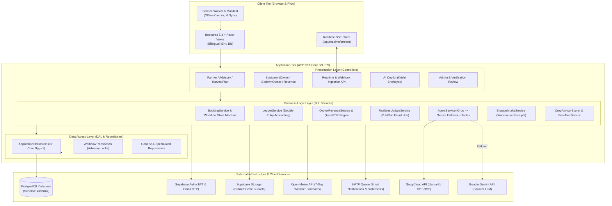

# KrishiLink — Smart Agriculture Platform

[](https://dotnet.microsoft.com/)
[](https://dotnet.microsoft.com/apps/aspnet)
[](https://docs.microsoft.com/ef/)
[](https://supabase.com/)
[](https://github.com/ArKoSaHa-AUST/KrishiLink)
[](https://groq.com/)
[](https://getbootstrap.com/)
[-28a745)](https://github.com/ArKoSaHa-AUST/KrishiLink)
[](https://github.com/ArKoSaHa-AUST/KrishiLink)
[](LICENSE)

**KrishiLink** is an enterprise-grade, 3-tier ASP.NET Core MVC agricultural marketplace and advisory ecosystem tailored for Bangladesh. It digitally connects **Farmers**, **Agricultural Equipment Owners**, and **Godown / Storage Facility Owners**, eliminating middlemen, maximizing machinery utilization, reducing post-harvest crop losses, and providing automated agro-climatic intelligence.

---

## Table of Contents

- [System Architecture](#system-architecture)
- [Role & Feature Matrix](#role--feature-matrix)
- [Core System Modules](#core-system-modules)
  - [1. Equipment Rental Marketplace & Fleet Inventory](#1-equipment-rental-marketplace--fleet-inventory)
  - [2. Godown Storage & Warehouse Receipts (QuestPDF + QR)](#2-godown-storage--warehouse-receipts-questpdf--qr)
  - [3. Realtime Updates & Webhook Streaming (SSE)](#3-realtime-updates--webhook-streaming-sse)
  - [4. Financial Ledger, Escrow & Revenue Analytics](#4-financial-ledger-escrow--revenue-analytics)
  - [5. AI Agro-Copilot — Krishi Shohayok (Groq + Gemini)](#5-ai-agro-copilot--krishi-shohayok-groq--gemini)
  - [6. Harvest Plan Cart & Season Economics](#6-harvest-plan-cart--season-economics)
  - [7. DAE Crop Calendar & Agro-Climatic Intelligence](#7-dae-crop-calendar--agro-climatic-intelligence)
  - [8. Weather & Predictive Pest Outbreak Early Warning](#8-weather--predictive-pest-outbreak-early-warning)
  - [9. Community Hub & Agricultural Knowledge Network](#9-community-hub--agricultural-knowledge-network)
  - [10. Verified Ratings & Hardened Reviews](#10-verified-ratings--hardened-reviews)
  - [11. Farmer Trust Profile & KYC Verification](#11-farmer-trust-profile--kyc-verification)
  - [12. Identity Verification & Encrypted NID PII Vault](#12-identity-verification--encrypted-nid-pii-vault)
  - [13. Wishlist / Favorites & Saved Search Alerts](#13-wishlist--favorites--saved-search-alerts)
  - [14. Multi-Channel Notifications & Idempotent Reminders](#14-multi-channel-notifications--idempotent-reminders)
  - [15. Bangladesh Geo-Hierarchy & Spatial Discovery](#15-bangladesh-geo-hierarchy--spatial-discovery)
  - [16. Offline-First PWA & Rural Accessibility](#16-offline-first-pwa--rural-accessibility)
  - [17. Security, Concurrency & Content Security Policy (CSP)](#17-security-concurrency--content-security-policy-csp)
  - [18. Dynamic & Seasonal Pricing Rules](#18-dynamic--seasonal-pricing-rules)
  - [19. Booking Modification & Capacity Rebalancing](#19-booking-modification--capacity-rebalancing)
- [Directory Structure](#directory-structure)
- [Technology Stack](#technology-stack)
- [Configuration & Environment Variables](#configuration--environment-variables)
- [Installation & Getting Started](#installation--getting-started)
- [Testing & Quality Assurance](#testing--quality-assurance)
- [Localization & Culture Support](#localization--culture-support)
- [License](#license)

---

## System Architecture

KrishiLink implements a layered **Clean 3-Tier Architecture** with high cohesion, strict isolation between presentation and persistence, and double-entry transactional financial guarantees.



---

## Role & Feature Matrix

| Feature Module | Farmers | Equipment Owners | Godown Owners | System Administrators |
| :--- | :---: | :---: | :---: | :---: |
| **Authentication & Profile** | Specialized Agro Profile | NID Verification & PII Vault | NID & Trade License Vault | Admin Oversight & Audit Portal |
| **Equipment Marketplace** | Search, Spatial Radius & Book | Multi-Unit Fleet & Rates | Browse Directory | Category & Listing Moderation |
| **Godown Storage Directory** | Capacity Booking & Intake | Browse Facilities | Weight/Month Rates & Lots | Facility Network Supervision |
| **Realtime Live Updates** | Instant Order/Status Alerts | Live Booking & Revenue Push | Live Storage & Intake Push | Platform Broadcast Alerts |
| **Booking & Settlement Lifecycle**| Active/Past Bookings & QR Passes | Accept/Reject & QR Verification | Accept/Reject & QR Verification | Dispute & Audit Investigation |
| **Financial Ledger & P&L** | Payment Receipts (QuestPDF) | Live Revenue, Escrow & P&L | Live Revenue, Escrow & P&L | Platform Commission & Ledger Check |
| **AI Farm Assistant** | Crop Advice, Search & Proposals | Price Guidance & Availability | Space Utilization Advice | Model Governance & Usage Audit |
| **Harvest Plan Cart** | Seasonal Plan Bundling & Clone | Plan Context Badges | Plan Context Badges | — |
| **DAE Crop Advisories** | 23 Crop Calendars by District | — | — | Crop Seed Data Management |
| **Weather & Early Pest Alerts** | 7-Day Forecasts & Disease Alerts | — | — | Regional Alert Overrides |
| **Community Knowledge Hub** | Create Posts, Vote & Discuss | Share Technical Tips | Storage Guidance & Q&A | Content Moderation & Pinning |
| **Verified Ratings & Reviews** | Review Completed Bookings (1-5★) | Public Owner Reply Thread | Public Owner Reply Thread | Moderate Abuse & Flagged Reviews |
| **Produce Intake & Gate Passes**| View Receipts & Lot Status | — | Issue A4 Receipts & Gate Release| Public QR Verification Audit |

---

## Core System Modules

### 1. Equipment Rental Marketplace & Fleet Inventory
- **Multi-Unit Inventory (`Quantity = 1..50`)**: Equipment owners can list fleets of machinery. The system prevents reducing inventory below the maximum concurrently booked units on any future date.
- **Concurrent Unit Booking (`Units = 1..Quantity`)**: Farmers can rent multiple units simultaneously with dynamic pricing (`Units × DailyRate × Days`).
- **Real-Time Availability Calendar**: Daily utilization tracking (`Σ Units booked`) displays full, partial (`.cal-partial`), or blackout dates.
- **Capacity-Aware Auto-Rejection**: Accepting an order automatically re-checks overlapping requests and only rejects those exceeding remaining free capacity.

### 2. Godown Storage & Warehouse Receipts (QuestPDF + QR)
- **Produce Intake Lots**: Godown owners record incoming commodity batches (crop, variety, number of bags, net weight in kg, moisture %, quality grade: Ungraded/Grade A/B/C, and bay/rack location) against `Paid` or `Completed` bookings.
- **Overfill Protection Guard**: Ensures stored net weight (`Σ Stored + New Lot`) cannot exceed booked storage capacity plus a 5% weighbridge tolerance.
- **Official Warehouse Receipts (QuestPDF)**: Generates canonical print-ready A4 PDF documents (`KL-WR-{yyyy}-{Id:D5}`) featuring facility credentials, commodity specifications, non-negotiable terms, and a tamper-evident QR verification seal.
- **Produce Release & Gate Pass**: Release workflows permanently mark lots as `RELEASED`, record the receiver's ID and gate pass notes, and lock the receipt against modification.

### 3. Realtime Updates & Webhook Streaming (SSE)
- **Server-Sent Events Pipeline (`/api/realtime/stream`)**: Global persistent streaming connection delivering instantaneous updates to all authenticated and anonymous browser sessions without polling.
- **Targeted Event Dispatching**: Supports broadcasting to specific users (`PublishToUserAsync`), specific roles (`PublishToRoleAsync`), or platform-wide channels (`PublishToAllAsync`).
- **Webhook Ingestion API (`/api/webhook/events`)**: Ingests external webhook events (Supabase Database Webhooks, payment gateway callbacks, IoT telemetry) and automatically re-broadcasts them to connected clients.
- **Frontend Realtime Client (`realtime-client.js`)**: Automatically connects on page load, plays subtle audio alerts, displays animated Bootstrap toast popups, updates notification badge counters live, and triggers table/chart re-renders.

### 4. Financial Ledger, Escrow & Revenue Analytics
- **Double-Entry Append-Only Ledger**: All monetary movements post to an immutable ledger (`FarmerExternal`, `PlatformEscrow`, `PlatformCommission`, `OwnerExternal`).
- **Conservation Invariant**: Guaranteed mathematical balance verified in CI and accessible via `/Home/LedgerCheck`:
  $$\sum \text{PaymentIn} - \sum \text{Refund} = \text{EscrowBalance} + \sum \text{CommissionEarned} - \sum \text{CommissionReversed} + \sum \text{PayoutOut}$$
- **State Machine Workflow (`BookingWorkflow`)**:
  - `Pending` $\xrightarrow{\text{accept}}$ `Accepted` $\xrightarrow{\text{pay}}$ `Paid` $\xrightarrow{\text{complete}}$ `Completed`
  - Accepting snapshots the agreed pricing (`AgreedRate`, `AgreedGross`, `CommissionRate = 5%`); subsequent rate edits never rewrite historical contracts.
- **Live Owner Revenue Dashboard**:
  - **KPIs & Horizon Scope**: Displays lifetime revenue, current month earnings, upcoming/active bookings (e.g. ৳58,500), and completed count across the active horizon.
  - **Breakdown by Listing**: Real-time listing performance, booked days, capacity utilization, and pipeline earnings.
  - **Settlement & Escrow Summary**: Clear visibility into gross revenue, 5% platform commission, net earnings, recorded expenses, in-escrow balances, and pending payouts.
  - **Profit & Loss / Tax Reporting**: Standalone A4 PDF generation for owners' tax advisers detailing deductible commission, categorized operating expenses (`Fuel`, `Labour`, `Repair`, `Transport`, `Fumigation`, `Utilities`), and net profit margins.

### 5. AI Agro-Copilot — Krishi Shohayok (Groq + Gemini)
- **Dual-Provider Failover Architecture**: Primary execution via Groq (`openai/gpt-oss-120b`), automatically falling back to Google Gemini (`gemini-3.5-flash-lite`) if Groq encounters rate limits or latency $> 10\text{s}$.
- **Read-Only Safety Invariant**: The AI toolset (`AgentTools`) only has access to read-only query interfaces (`IEquipmentQueries`, `IGodownQueries`, `IBookingQueries`, `IWeatherSuggestionQueries`). It is structurally impossible for the model to mutate bookings, issue payouts, or delete records.
- **Server-Side Proposal Gating**: To create a booking, the assistant outputs a pre-filled proposal card (`_AiAgentProposal.cshtml`). The farmer explicitly submits this form through the standard CSRF-protected, workflow-locked MVC action. Proposals expire in 15 minutes.
- **Strict Data Redaction & Budgeting**: PII (NID, phone numbers, emails, payment tokens) is strictly omitted from tool results. Enforces daily quotas (120,000 tokens/user/day, 8 turns/min, 2,000 chars/message).

### 6. Harvest Plan Cart & Season Economics
- **Multi-Item Seasonal Cart**: Farmers can bundle up to 10 equipment rentals and godown storage bookings into a single seasonal plan.
- **Fail-Fast Two-Pass Validation**: Validates all items simultaneously before atomically creating linked bookings.
- **Seasonal Plan Duplication**: One-click cloning allows shifting previous plans by customizable days (e.g. +365 days) for rapid recurring season planning.
- **Season Economics & Break-Even Analysis (`/HarvestPlan/Season/{id}`)**: Calculates total operational costs (machinery, storage, seed, fertilizer, labour), forecasted yield, gross/net revenue estimates, and break-even harvest volumes.

### 7. DAE Crop Calendar & Agro-Climatic Intelligence
- **DAE 23-Crop Reference Database**: Comprehensive cultivation data based on Bangladesh Department of Agricultural Extension (DAE) guidelines.
- **Dynamic Agronomic Scorer (`CropAdvisorScorer`)**: Rates crop suitability out of 100 based on 6 weighted factors: Season (30%), Sowing Window (20%), Soil Type (20%), Irrigation (15%), Region (10%), and Soil pH (5%). Minimum threshold of 45 required for recommendation.
- **Sowing Date Simulator & ICS Calendar Export**: Enables farmers to simulate maturity dates based on sowing timing and export activities directly to Google/Apple Calendar (`.ics`).

### 8. Weather & Predictive Pest Outbreak Early Warning
- **Open-Meteo Integration**: Real-time 7-day daily weather forecasts for all 64 districts in Bangladesh with GPS centroid coordinates.
- **Automated Pest Outbreak Detection Engine**: Analyzes multi-day humidity (>80%) and precipitation trends to predict diseases (e.g. Potato Late Blight, Rice Blast, Aphid Infestations) and provides preventative biological and chemical advisories.

### 9. Community Hub & Agricultural Knowledge Network
- **Discussion Feeds & Category Filtering**: Public forum covering *Crop Advisory*, *Machinery & Tech*, *Storage & Marketing*, *Government Schemes*, and *Success Stories*.
- **AJAX Comments & Interaction**: Modal-based thread viewing, real-time comment submission, upvoting/liking, and view counter tracking.
- **Administrative Moderation**: Admins can pin announcements, lock threads, or remove abusive content.

### 10. Verified Ratings & Hardened Reviews
- **Verified Booking Constraint**: Only farmers who have physically completed a booking can submit a review and star rating (1–5★).
- **Atomic Rating Aggregation**: Listing-level and owner-level aggregate ratings (`OwnerAverageRating`, `OwnerReviewCount`) update atomically within single database transactions, resilient against race conditions.
- **Owner Response Workflow**: Equipment and godown owners can submit official public replies to customer feedback.

### 11. Farmer Trust Profile & KYC Verification
- **Trust Metrics for Owners**: Displays completed bookings, active rentals, cancellation rates, punctuality, and repeat customer history.
- **Privacy-Scoped Visibility**: Access is restricted strictly to Admins and Owners with whom the farmer has an active or past booking request.

### 12. Identity Verification & Encrypted NID PII Vault
- **Encrypted at Rest**: NID numbers are encrypted with ASP.NET Core `IDataProtectionProvider` (`KrishiLink.Nid`). Masked strings (`***-***-1234`) are exposed in views.
- **Private Storage Streaming**: Document uploads (NID front/back, trade licenses) stream from private Supabase buckets through authenticated endpoints with `Cache-Control: private, no-store`.

### 13. Wishlist / Favorites & Saved Search Alerts
- **Farmer Favorites (`/Favorites`)**: Real-time bookmarking with instant availability status indicators.
- **Saved Search Match Scheduler (`SavedSearchAlertScheduler`)**: Background service periodically evaluating active search queries against new inventory and sending deduplicated email and in-app alerts.

### 14. Multi-Channel Notifications & Idempotent Reminders
- **Asynchronous Email Queue (`EmailDispatchService`)**: Non-blocking `System.Threading.Channels` pipeline for transactional receipts and alerts.
- **Idempotent Reminder Scheduler (`ReminderScheduler`)**: Time-based background service for rental start reminders, return deadlines, and storage expiry notices, deduplicated via `(UserId, DedupeKey)` database indexes.

### 15. Bangladesh Geo-Hierarchy & Spatial Discovery
- **64-District Administrative Mapping (`BangladeshGeo`)**: Maps 64 districts across 8 divisions with centroid GPS coordinates.
- **Spatial Radius Search**: "Near me" search within $N\text{ km}$ using index-backed bounding boxes and SQL Haversine distance calculations.

### 16. Offline-First PWA & Rural Accessibility
- **Progressive Web App (`manifest.json` & `sw.js`)**: Fully installable with offline caching of advisory data, crop guides, and last-viewed forecasts.
- **Local Measurement Units**: Support for Decimal, Katha, Bigha (33 decimals), Acre, and Maund (40 kg).

### 17. Security, Concurrency & Content Security Policy (CSP)
- **Sharded Workflow Locks**: Advisory lock concurrency (`Database:ShardedWorkflowLocks=true`) isolates contention to specific listings or users.
- **Optimistic Concurrency (`xmin`)**: Concurrency tokens protect bookings, equipment, and godowns against stale concurrent overwrites.
- **Strict Content-Security-Policy**: Enforces per-request script nonces, blocks inline event handlers (uses `data-onclick`), and isolates frames.

### 18. Dynamic & Seasonal Pricing Rules
- **Rule Hierarchy**: Equipment listings support Season rules (date ranges) and Weekend rules (Friday/Saturday) that override base daily rates.
- **Live Debounced Quoting API**: `GET /Equipment/Quote` calculates multi-segment pricing breakdowns in real-time during checkout.

### 19. Booking Modification & Capacity Rebalancing
- **Pre-Payment Modification**: Farmers can adjust dates or units on `Pending` or unpaid `Accepted` bookings up to 3 times, resetting snapshots for owner re-approval.
- **Self-Excluding Availability**: Modifications exclude the booking's own ID during conflict validation.

---

## Directory Structure

```
KrishiLink/
├── Controllers/                  # Presentation Layer MVC & API Controllers
│   ├── Admin/                    # Verification & Remediation Workflows
│   ├── AccountController.cs      # Supabase Auth, Registration, Profiles & KYC Docs
│   ├── AdvisoryController.cs     # Weather Forecasts, DAE Crop Calendars & Pest Engine
│   ├── AiAgentController.cs      # Krishi Shohayok AI Copilot API & Chat History
│   ├── BookingsController.cs     # Booking Management, Receipts & Modifications
│   ├── CommunityController.cs    # Community Hub, Posts, Comments & Likes
│   ├── EquipmentController.cs    # Machinery Catalog, Search, Live Quotes & Details
│   ├── EquipmentOwnerController.cs# Fleet Inventory, Requests, Calendar & Revenue
│   ├── FarmerController.cs       # Farmer Hub, Dashboard & Advisory Summaries
│   ├── FarmerProfileController.cs# Privacy-Scoped Farmer Trust Profiles
│   ├── FavoritesController.cs    # Wishlist & AJAX Heart Toggles
│   ├── GodownController.cs       # Storage Directory, Capacity Booking & Details
│   ├── GodownOwnerController.cs  # Facility Listings, Space Requests & Produce Intake
│   ├── HarvestPlanController.cs  # Multi-Item Cart, Seasonal Plans & Economics
│   ├── HomeController.cs         # Landing Page, Privacy, Ledger Audit & Language
│   ├── RealtimeController.cs     # SSE Stream (/api/realtime/stream) & Webhooks
│   ├── ReviewsController.cs      # Verified Reviews & Owner Reply Threads
│   └── VerifyController.cs       # Public QR Verification (Bookings & Warehouse Receipts)
├── Views/                        # Strongly-Typed Razor Views & Partials
│   ├── Account/                  # Auth, Login, Registration, Password Reset & KYC
│   ├── Advisory/                 # Crop Calendars, Weather Forecasts & Pest Advisories
│   ├── Community/                # Community Hub Feed, Post Details & Modals
│   ├── Equipment/                # Catalog Grid, Filters, Map View & Machine Details
│   ├── EquipmentOwner/           # Listings Management, Bookings Calendar & Blocking
│   ├── Farmer/                   # Farmer Overview Dashboard
│   ├── Godown/                   # Godown Catalog & Space Booking Views
│   ├── GodownOwner/              # Godown Dashboard, Produce Lots & Receipts
│   ├── HarvestPlan/              # Cart Overview, Plan Details & Economics Summary
│   ├── Shared/                   # Layout, Navigation, Realtime SSE Scripts, Modals, Revenue
│   └── Verify/                   # Public QR Verification Landing Pages
├── Models/                       # Domain Entities & ViewModels
│   ├── Entities/                 # EF Core Entities (User, Equipment, Godown, Booking, etc.)
│   └── ViewModels/               # ViewModels for Forms, Dashboards, Invoices & Reports
├── BLL/                          # Business Logic Layer
│   └── Services/                 # Domain Services (Booking, Ledger, Revenue, AI, Weather, etc.)
│       └── Ai/                   # AgentService, AgentTools, Prompt Templates & Groq/Gemini Client
├── DAL/                          # Data Access Layer
│   ├── ApplicationDbContext.cs   # EF Core DbContext with 'krishilink' schema configuration
│   ├── DbInitializer.cs          # Role seeding and 23 DAE Crop reference initializers
│   ├── Repositories/             # Repository Pattern Implementations
│   └── Migrations/               # PostgreSQL Baseline and Incremental Migrations
├── Resources/                    # Localization Resource Files (.en.resx and .bn.resx)
├── wwwroot/                      # Static Assets (CSS, Vanilla JS, Bootstrap Icons, Leaflet)
├── appsettings.json              # Application Configuration Profiles
└── Program.cs                    # Application Entrypoint, DI Container & Middleware Pipeline
```

---

## Technology Stack

- **Framework**: C# / ASP.NET Core 8.0 LTS (fully compatible with .NET 9.0 SDK)
- **Database & Storage**: PostgreSQL on Supabase, Entity Framework Core 8.0, Npgsql
- **Authentication**: Supabase Auth (Email OTP / Magic Links) + ASP.NET Identity Cookie Bridge
- **AI / LLM Providers**: Groq Cloud API (`openai/gpt-oss-120b`) with Google Gemini fallback (`gemini-3.5-flash-lite`)
- **Realtime Infrastructure**: Server-Sent Events (SSE) with In-Memory Pub/Sub and Webhook Ingestion
- **Document Generation**: QuestPDF (Community License) for A4 Statements, Warehouse Receipts & Invoices
- **QR Code Engine**: QRCoder for tamper-evident digital verification
- **Imaging & Thumbnails**: SixLabors.ImageSharp for WebP optimization and EXIF metadata stripping
- **Mapping & GIS**: Leaflet.js + OpenStreetMap Tiles
- **UI Framework**: Razor Views (HTML5), Bootstrap 5.3, Bootstrap Icons, Vanilla JavaScript
- **Localization**: Full Bilingual Support (`en-US` and `bn-BD`)

---

## Configuration & Environment Variables

Copy `.env.example` to `.env.local` to configure your environment.

| Variable Name | Description | Default / Example |
| :--- | :--- | :--- |
| `SUPABASE_URL` | Supabase Project URL | `https://xyz.supabase.co` |
| `SUPABASE_PUBLISHABLE_KEY` | Public Anon API Key | `eyJhbGci...` |
| `SUPABASE_SECRET_KEY` | Server-Side Service Role Key | `eyJhbGci...` |
| `ConnectionStrings__SessionConnection`| Direct/Session PostgreSQL Connection (Port 5432) | `Host=...;Port=5432;Database=postgres;...` |
| `DIRECT_URL` | Direct PostgreSQL Connection for Migrations | `Host=...;Port=5432;Database=postgres;...` |
| `SUPABASE_PUBLIC_BUCKET` | Public Listing Images Bucket | `listing-images` |
| `SUPABASE_PRIVATE_BUCKET` | Private KYC Documents Bucket | `verification-documents` |
| `App__PublicBaseUrl` | Canonical External URL | `https://localhost:7276` |
| `GROQ_API_KEY` | Groq API Key for AI Assistant | `gsk_...` |
| `GEMINI_API_KEY` | Google Gemini API Key for AI Fallback | `AIza...` |
| `DataProtection__KeyPath` | Persistent Keyring Path for NID Encryption | `App_Data/keys` |

---

## Installation & Getting Started

### Prerequisites
- [.NET 8.0 SDK](https://dotnet.microsoft.com/download) or [.NET 9.0 SDK](https://dotnet.microsoft.com/download)
- A [Supabase Project](https://supabase.com/) with PostgreSQL and Storage enabled
- [Git](https://git-scm.com/)

### Step-by-Step Setup

1. **Clone the Repository**:
   ```bash
   git clone https://github.com/ArKoSaHa-AUST/KrishiLink.git
   cd KrishiLink
   ```

2. **Configure Environment Variables**:
   ```bash
   cp .env.example .env.local
   # Edit .env.local with your Supabase credentials and database connection string
   ```

3. **Restore Dependencies & Build**:
   ```bash
   dotnet restore KrishiLink.sln
   dotnet build KrishiLink.sln -c Release
   ```

4. **Apply Database Migrations**:
   ```bash
   dotnet ef database update
   ```

5. **Run the Application**:
   ```bash
   dotnet run --launch-profile https
   ```
   Open your browser at `https://localhost:7276` (or `http://localhost:5141`).

---

## Testing & Quality Assurance

The project includes an exhaustive automated test suite with **1,041 unit, integration, and architecture invariant tests** across both default and sharded workflow locking modes.

### Docker & Render Deployment (CI/CD)

KrishiLink is fully containerized and configured for automated Continuous Integration and Continuous Deployment (CI/CD) to **Render**:

- **One-Click Deploy**: The repository includes [`render.yaml`](./render.yaml) (Render Blueprint) that sets up the Web Service, environment configurations, health check probe (`/healthz`), and persistent volume mount for Data Protection keys (`/app/App_Data/keys`).
- **Production Dockerfile**: Multi-stage, secure, non-root `.NET 8` image supporting dynamic port binding (`$PORT`) on Render or standard `8080`.
- **Local Stack with Docker Compose**: Run the app and local PostgreSQL via `docker compose up -d --build`.
- **Automated CI/CD**:
  - `.github/workflows/ci.yml`: Runs formatting, security scans, unit & PostgreSQL integration test suites, EF Core migration checks, and verifies Docker image builds on every PR/push.
  - `.github/workflows/deploy.yml`: Generates release bundles, produces idempotent `migrations.sql`, and automatically triggers zero-downtime deployment on Render via `RENDER_DEPLOY_HOOK_URL`.
- **Complete Step-by-Step Guide**: See [`DEPLOYMENT_RENDER.md`](./DEPLOYMENT_RENDER.md) for full setup instructions, secret variable configuration, and persistent disk mounting.

### Security headers and Content-Security-Policy
```bash
# Run unit and architectural invariant tests
dotnet test KrishiLink.sln

# Run integration tests against a dedicated PostgreSQL instance
export KRISHILINK_TEST_POSTGRES="Host=127.0.0.1;Port=5432;Username=postgres;Password=postgres;Database=postgres"
dotnet test KrishiLink.sln

# Run test suite under sharded workflow locking mode
KRISHILINK_TEST_SHARDED_LOCKS=true dotnet test KrishiLink.sln
```

### Key Test Categories
- **Ledger Conservation & Double-Entry Invariants**: Proves mathematical balance across all transactions and refunds.
- **Workflow Locking & Race Conditions**: Tests concurrent bookings, racing payouts, and simultaneous modification requests.
- **Authorization & Public Surface Invariants**: Ensures all controller actions require authorization unless explicitly allowlisted.
- **Async Surface & Non-Blocking Execution**: Verifies no `.Result` or `.Wait()` calls block thread pool threads outside entrypoints.
- **AI Tool Safety & PII Sanitization**: Proves AI tools cannot mutate data or leak sensitive personal information.

---

## Localization & Culture Support

KrishiLink provides native dual-language localization in **Bengali (বাংলা)** and **English**:
- **Culture Switching**: Dynamic switching via the top navigation bar without page reloads.
- **Full Key Parity**: 100% string coverage across `Resources/SharedResource.en.resx` and `Resources/SharedResource.bn.resx`.
- **Unicode Support**: Configured with `UnicodeRanges.All` to ensure proper rendering of Bengali script without entity escaping issues.

---

## License

This project is licensed under the **MIT License** — see the [LICENSE](LICENSE) file for details.
